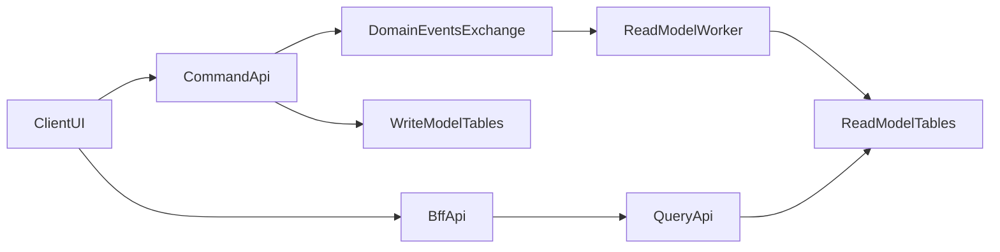

# CQRS + BFF Implementation Guide

## Цель

В backend реализованы отдельные контуры:

- `Command API` для изменения состояния
- `Query API` для чтения денормализованной read-model
- `BFF API` для клиентских контрактов `web` и `mobile`
- `Domain Events + RabbitMQ + ReadModelWorker` для eventual consistency

## Поток данных

## Write model

Нормализованные таблицы:

- `asset`
- `service_request`
- `work_order`
- `escalation`
- `technician`
- `audit_record`

Команды меняют только write model и публикуют события.

## Read model

Денормализованные таблицы:

- `read_request_list_item`
- `read_request_detail`
- `read_work_order_item`
- `analytics_snapshot`
- `read_projection_error`

Read-model обновляется только worker-ом после получения доменных событий из RabbitMQ.

## Command API

Новые mutation-endpoint'ы:

- `POST /api/v1/commands/assets`
- `POST /api/v1/commands/requests`
- `PUT /api/v1/commands/requests/{id}/status`
- `POST /api/v1/commands/work-orders`
- `PUT /api/v1/commands/work-orders/{id}/assign`
- `POST /api/v1/commands/escalations`
- `POST /api/v1/commands/technicians`

Все commands:

- валидируют входные DTO
- ограничены JWT + RBAC
- инвалидируют кэш за счет mutation-path
- публикуют domain events

## Query API

Новые read-endpoint'ы:

- `GET /api/v1/query/requests`
- `GET /api/v1/query/requests/{id}`
- `GET /api/v1/query/dashboard/summary`
- `GET /api/v1/query/dashboard/sla-compliance`
- `GET /api/v1/query/dashboard/sla-compliance-by-priority`
- `GET /api/v1/query/dashboard/technicians/workload`
- `GET /api/v1/query/heatmap`

Особенности:

- Query слой не использует ORM для чтения read-model
- чтение идет raw SQL с параметризованными запросами
- ответы возвращаются как read DTO, а не как domain entities

## BFF API

### Web

- `GET /api/v1/bff/web/dashboard`
- `GET /api/v1/bff/web/requests`
- `GET /api/v1/bff/web/requests/{id}`

### Mobile

- `GET /api/v1/bff/mobile/home`
- `GET /api/v1/bff/mobile/requests`
- `GET /api/v1/bff/mobile/requests/{id}`

BFF:

- выдает отдельные DTO под `web` и `mobile`
- агрегирует несколько query в один UI-ответ
- не отдает raw write-model во frontend

## Domain events

Минимальный набор событий:

- `service_request.created`
- `service_request.status_changed`
- `work_order.created`
- `work_order.assigned`
- `work_order.started`
- `work_order.completed`
- `escalation.created`
- `escalation.resolved`

Формат payload:

- `event_id`
- `event_type`
- `entity_id`
- `owner_user_id`
- `occurred_at_epoch_sec`
- `payload`

## Worker и eventual consistency

Режимы запуска:

- `APP_MODE=api`
- `APP_MODE=worker`
- `APP_MODE=queue_worker`
- `APP_MODE=read_model_worker`

Read-model worker:

- подписывается на `service_processes.events`
- пересчитывает denormalized read tables
- обновляет `analytics_snapshot`
- пишет ошибки в `read_projection_error`

Это означает eventual consistency: сразу после command query/BFF может кратковременно вернуть предыдущее состояние, пока событие не обработано worker-ом.

## Heatmap и метрики

Самые горячие точки:

- Частые запросы: `list_requests`, `dashboard_summary`, `get_request_detail`
- Тяжелые команды: `create_request`, `update_request_status`, `assign_work_order`, `create_escalation`
- Очередь: `delivery_received`, `projection_success`, `projection_error`

Текущая heatmap доступна через:

- `GET /api/v1/query/heatmap`

## Кэш

GET-ответы кэшируются в Redis.

После command-запросов кэш инвалидируется, чтобы Query/BFF могли прочитать обновленную read-model после обработки событий.

## Безопасность

Реализовано:

- JWT с `exp` и настраиваемым `JWT_TTL_HOURS`
- `POST /auth/refresh`
- RBAC + `DataScope`
- rate limiting для `login`, `query`, `bff`
- CORS whitelist через `CORS_ALLOWED_ORIGINS`
- валидация входных DTO и запрет опасных `<` / `>` во входных текстах
- parameterized SQL в query layer

## Как проверить

1. Запустить PostgreSQL, Redis, RabbitMQ.
2. Запустить API: `APP_MODE=api cargo run`
3. Запустить read worker: `APP_MODE=read_model_worker cargo run`
4. Выполнить command, например `POST /api/v1/commands/requests`
5. Проверить появление данных в `GET /api/v1/query/requests`
6. Проверить агрегированный ответ в `GET /api/v1/bff/web/requests`
7. Проверить счетчики в `GET /api/v1/query/heatmap`

## Git workflow

- ветка на фичу: `feature/<short-name>`
- коммиты маленькие и тематические
- PR должен содержать:
  - что реализовано
  - какие endpoint'ы добавлены
  - как проверить вручную
  - какие worker/infra prerequisites нужны
